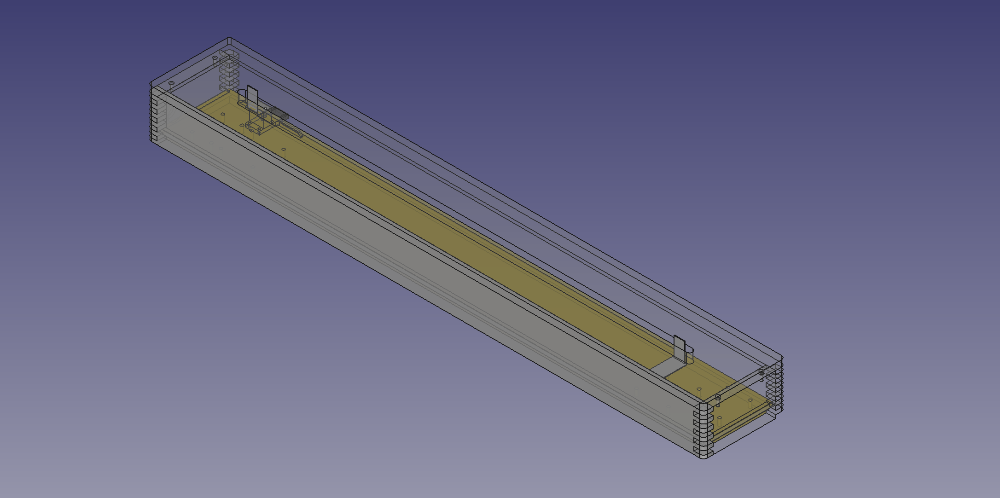

# 兎時計

ESP32でステッピングモーターを制御して直線上に時・分を示す壁掛け時計。
兎と亀がモチーフ。

## 設定方法

下記URLから時計の設定が可能。(対応環境:Bluetooth Low Energyに対応したマシン/iOS非対応 Chrome系ブラウザ)

[https://ayumu-bekki.github.io/rabbit_clock/web_client/](https://ayumu-bekki.github.io/rabbit_clock/web_client/)

## ソフトウェア

* ESP-IDF v5.2 (https://docs.espressif.com/projects/esp-idf/en/latest/esp32/get-started/)

## ハードウェア

### 回路図

- メインマイコン
    - [ESP32-DevKitC V4ボード](https://docs.espressif.com/projects/esp-idf/en/stable/esp32/hw-reference/esp32/get-started-devkitc.html#get-started-esp32-devkitc-board-front) 
- ステッピングモータードライバー
    - AT2100 https://ja.aliexpress.com/item/1005002225468581.html
- マイクロスイッチ
    - OMRON スイッチ SS-5GL2
- ステッピングモーター
    - 17hs08 1004s https://ja.aliexpress.com/item/4001014382025.html

### 機械設計図

[図面(FreeCAD)](docs/rabbit_clock_drawing.FCStd)

モーターブラケット・アイドラーブラケット・スライダーベースは、アルミニウム(A5052)削り出し

- スライドガイド
    - ミスミ スライドガイド SSEBZ-MX13-720
- アイドラー固定用軸 
    - ミスミ カタモチピンダンツキ SFXBA5A-9-F9
- プーリー・タイミングベルト
    - GT2 プーリー20mm ボア5mm 3Dプリンターキット https://ja.aliexpress.com/item/1005003025244723.html
    - ※上記商品だけではタイミングベルトの長さが足りないので別途入手が必要

## 開発メモ

### ステッピングモーター駆動
esp-idfにPWM(ledc mcpwm)が存在するが、パルス数調整ができないためステッピングモーター制御には利用できない。
ウェブを彷徨うとGPIO + nopを組み合わせる方法があり、動作はするもののCPUリソースを使い果たすため2台同時制御ができないことから、この方法も却下。
General Purpose Timerの割り込みでGPIOをOn/Offする仕組みで実装しました。オシロスコープで確認したらちゃんと精度が出ている。

ステッピングモーターの動作は別コアで非同期で動かしたかった。初めはあらかじめタスクを作ってQueueでWakeUpする仕組みにしていたが
esp_pthread_set_cfgでスレッド作成時のコアを指定できることが分かったので、std::asyncを利用する方法に変更。
https://docs.espressif.com/projects/esp-idf/en/latest/esp32/api-reference/system/pthread.html

ステッピングモータードライバーは設定を変更することでA4988やTMC2208でも動作しますが、これらはモーターからの音がうるさく時計用途には微妙。

ステッピングモーター制御については以下の記事を参考にした。
https://howtomechatronics.com/tutorials/arduino/how-to-control-stepper-motor-with-a4988-driver-and-arduino/

### Bluetooth Low Energy対応
物理ボタンを設置したくなかったので、Bluetooth Low Energyから設定・デモ動作を行えるようにしました。

[Bluetooth Low Energyをはじめよう (Make:PROJECTS) ](https://www.amazon.co.jp/dp/4873117135)を購入したが、Webにある記事で十分だった。
Bluetooth Low Energyについては以下記事で学びました。
https://www.musen-connect.co.jp/blog/course/trial-production/ble-beginner-1/

クライアントはBlueJellyを利用
https://monomonotech.jp/kurage/webbluetooth/getting_started.html
https://github.com/electricbaka/bluejelly

### その他・メモ

#### ESP32シリアルポート指定でのflash/monitor

BOOTボタンを押しながらENボタンを押す

idf.py flash -p /dev/cu.usbserial-110 -b 115200

idf.py monitor -p /dev/cu.usbserial-110 -b 115200

#### ステッピングモーター17hs08 1004s配線

- 2B (B- Black)
- 2A (B+ Grren)
- 1A (A+ Blue)
- 1B (A- Red)
