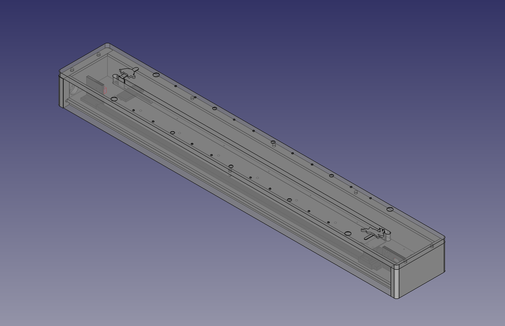

# ノウサギとリクガメの時計

ESP32でステッピングモーターを制御して直線上に時・分を示す壁掛け時計。
http://blog.bekki.jp/article/190781348.html

## 設定方法

下記URLから時計の設定が可能。(対応環境:Bluetooth Low Energyに対応したマシン/iOS非対応 Chrome系ブラウザ)

[https://ayumu-bekki.github.io/hare_tortoise_clock/web_client/](https://ayumu-bekki.github.io/hare_tortoise_clock/web_client/)

## ソフトウェア

* ESP-IDF v5.2 (https://docs.espressif.com/projects/esp-idf/en/latest/esp32/get-started/)

## ハードウェア

### 回路図

- メインマイコン
    - [ESP32-DevKitC V4ボード](https://docs.espressif.com/projects/esp-idf/en/stable/esp32/hw-reference/esp32/get-started-devkitc.html#get-started-esp32-devkitc-board-front) 
- ステッピングモータードライバー
    - AT2100 https://ja.aliexpress.com/item/1005002225468581.html
- マイクロスイッチ
    - OMRON スイッチ SS-5GL2
- ステッピングモーター
    - 17hs08 1004s https://ja.aliexpress.com/item/4001014382025.html

### 機械設計図

[図面(FreeCAD)](docs/hare_tortoise_clock_drawing.FCStd)

モーターブラケット・アイドラーブラケット・スライダーベースは、アルミニウム(A5052)削り出し

- スライドガイド
    - ミスミ スライドガイド SSEBZ-MX13-720
- アイドラー固定用軸 
    - ミスミ カタモチピンダンツキ SFXBA5A-9-F9
- プーリー・タイミングベルト
    - GT2 プーリー20mm ボア5mm 3Dプリンターキット https://ja.aliexpress.com/item/1005003025244723.html
    - ※上記商品だけではタイミングベルトの長さが足りないので別途入手が必要

### ステッカー

[本体貼付用(psd)](docs/hare_tortoise_clock_sticker.psd)
